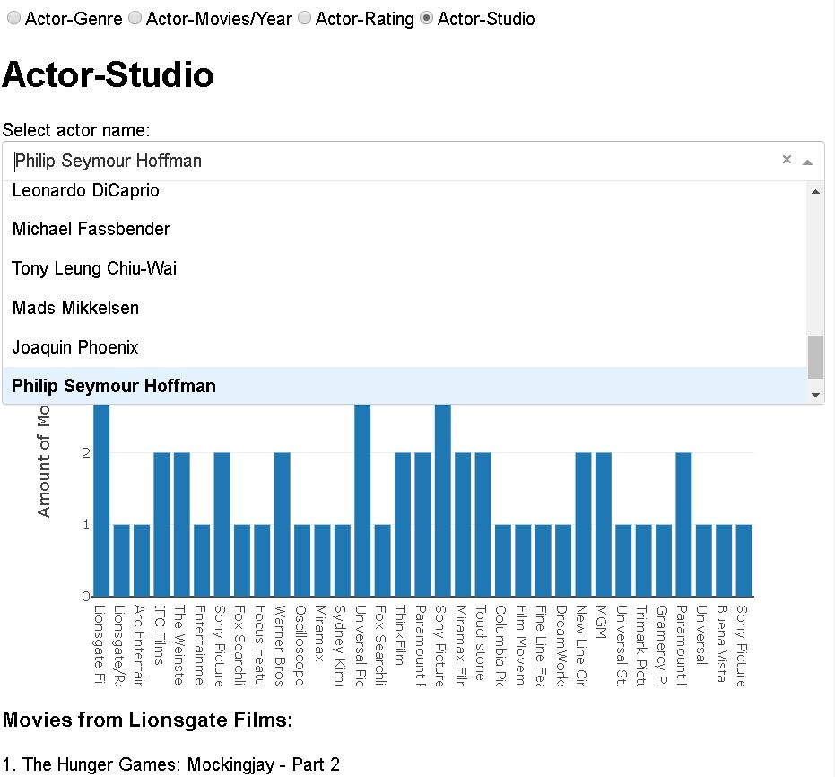
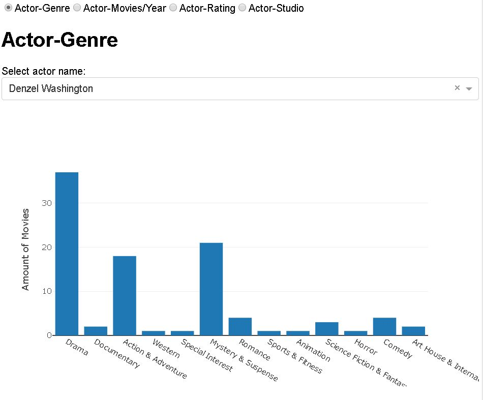
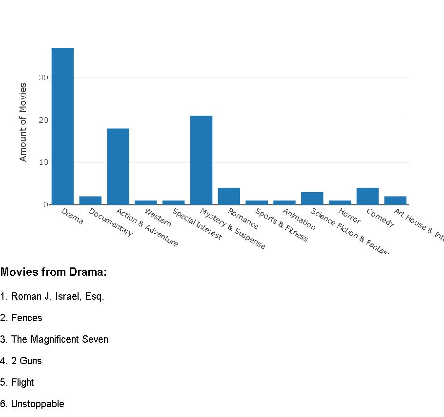
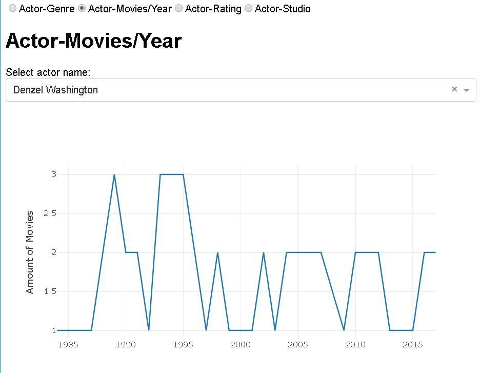
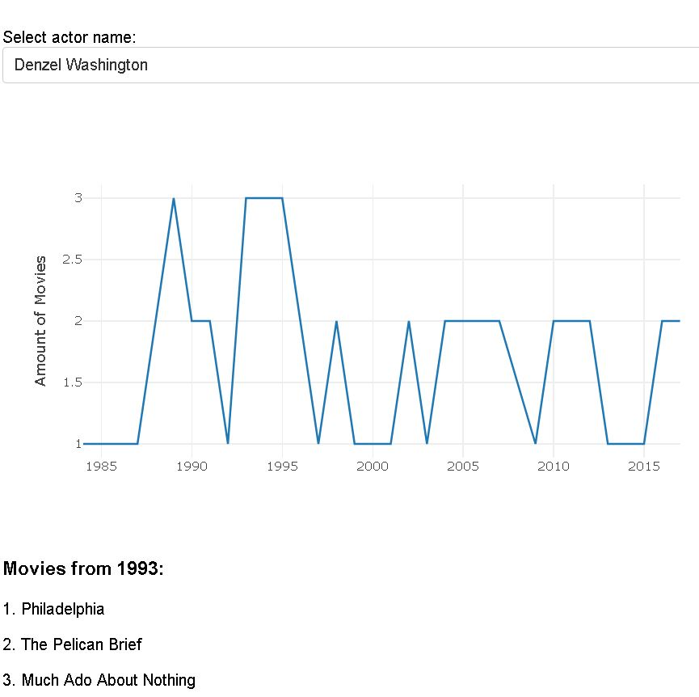
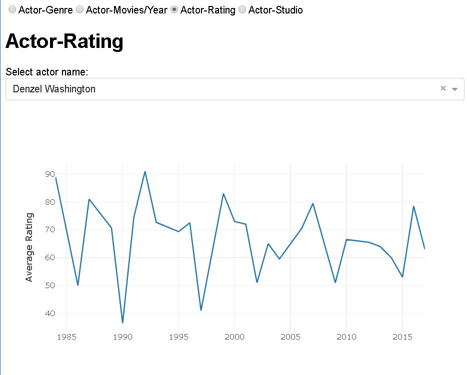
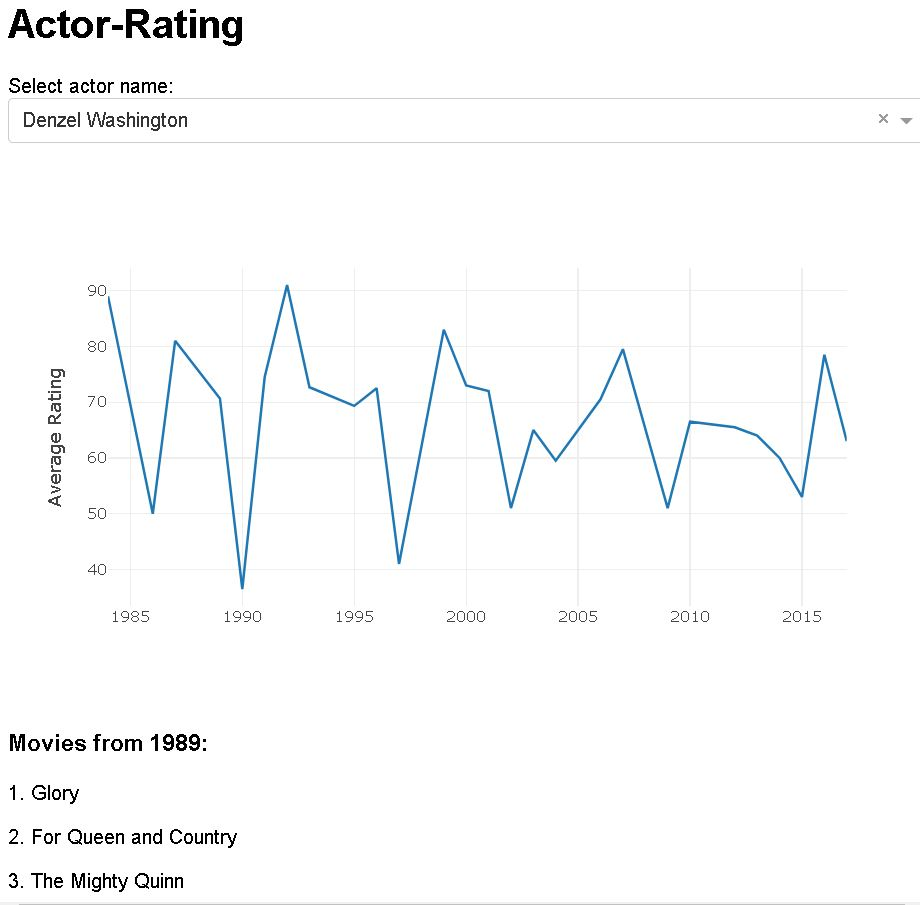
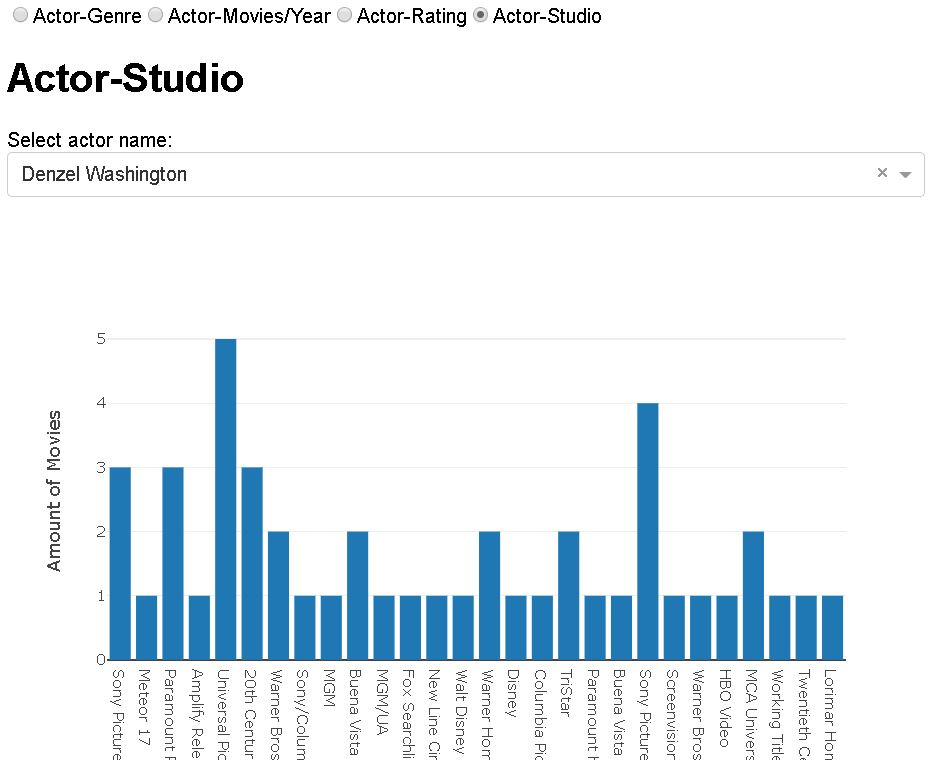
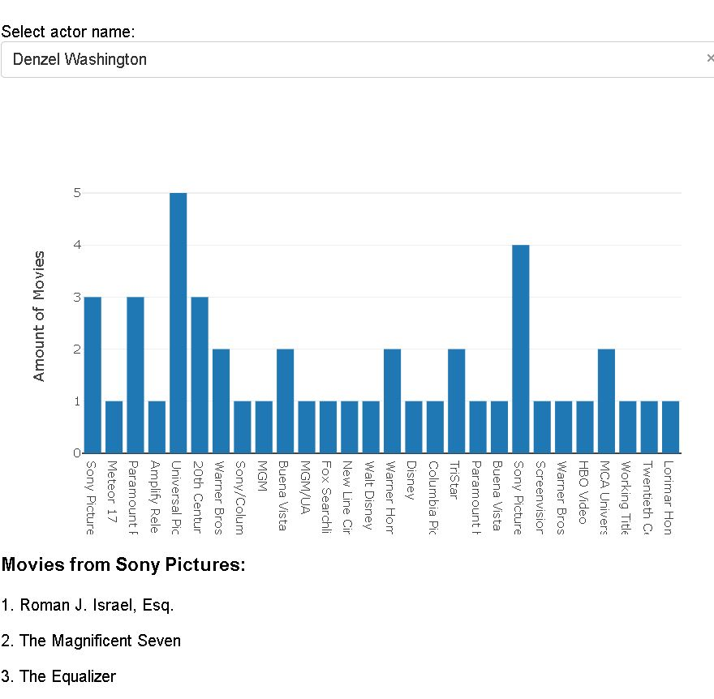

<h1 align="center">
   
  Tugas 2 Seleksi Basis Data 2018
   
   
</h1>

<h2 align="center">
   
  Visualisasi Data Film
   
   
</h2>

### Definisi
Visualisasi data dilihat oleh banyak bidang ilmu sebagai komunikasi visual modern. Visualisasi data tidak berada di bawah bidang manapun, melainkan interpretasi di antara banyak bidang). Visualisasi data mengikutkan pembuatan dan kajian dari representasi visual dari data. Visualisasi data adalah bentuk komunikasi dengan media visual untuk mendeskripsikan dan mengkomunikasikan informasi dari data secara mangkus dan sangkil pada pengguna.

### Visualisasi
Kami telah mengambil data yang diperlukan. Data yang telah diambil divisualisasikan dalam 4 hubungan. Hubungan tersebut yaitu: Actor-Genre, Actor-Movies/Year, Actor-Rating, dan Actor-Studio. Ditampilkan jumlah dari masing-masing tahun, genre, rating, atau studio dari aktor yang dipilih. Apabila salah satu data tahun, genre, rating, atau studio dari aktor diklik, akan ditampilkan rincian dari jumlah tersebut. 
 
Adapun langkah pertama dalam menjalankan program adalah dengan menjalankan *app.py* dalam folder src melalui *command prompt*.  Setelah itu memasukkan alamat yang diberikan dalam *command prompt* ke peramban. Bilamana situs telah dibuka, terdapat pilihan 4 hubungan dan pilihan nama aktor. Anda dapat memilih aktor yang ingin dilihat datanya atau memilih hubungan aktor.

### Hasil

#### Memilih aktor
 
 

#### Actor-Genre
 
 
Untuk genre, didapat Denzel Washington terbanyak memerankan di film Drama dengan jumlah 37.
 
 

#### Actor-Genre dan deskripsi data 
 
 

#### Actor-Movies/Year
 
 
Untuk film pertahun, didapat Denzel Washington terbanyak memerankan di tahun 1989, 1993, dan 1995 dengan jumlah 3 film.
 
 

#### Actor-Movies/Year dan deskripsi data 
 
 

#### Actor-Rating
 
 
Untuk rating, didapat Denzel Washington tertinggi ratingnya memerankan di tahun 1992 dengan jumlah 91 persen.
 
 

#### Actor-Rating dan deskripsi data 
 
 

#### Actor-Studio
 
 
Untuk studio, didapat Denzel Washington terbanyak memerankan di film buatan Universal Pictures dengan jumlah 5.
 
 

#### Actor-Studio dan deskripsi data 
 
 

### Kesimpulan
Data Film dan actor telah diambil dan divisualisasikan. Data divisualisasikan dalam 4 hubungan. Hubungan tersebut yaitu: Actor-Genre, Actor-Movies/Year, Actor-Rating, dan Actor-Studio. Ditampilkan jumlah dari masing-masing tahun, genre, rating, atau studio dari aktor yang dipilih. 

   
  13516121 Nicholas Wijaya
   
  13516135 Untung Tanujaya
   
   

